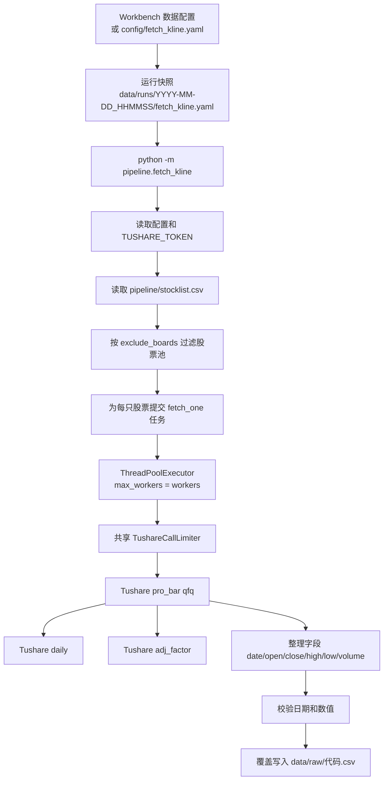
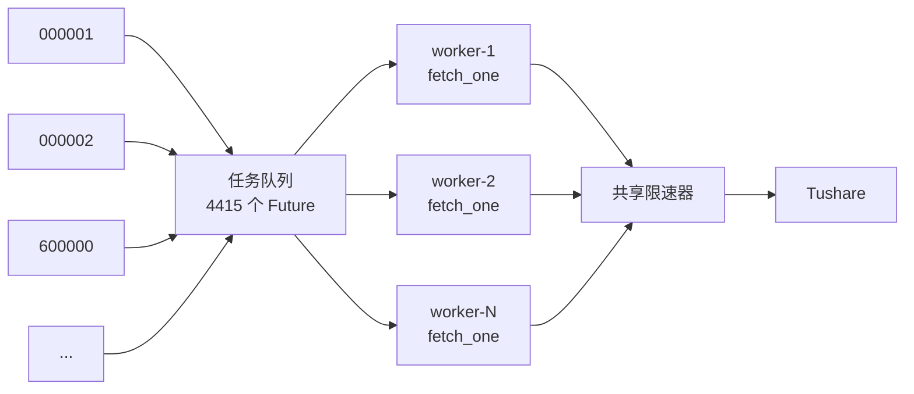
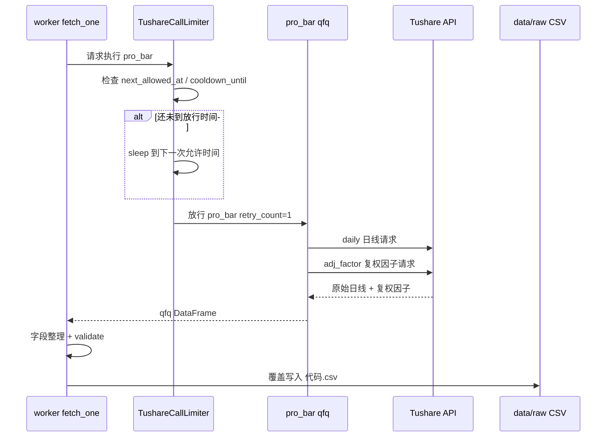
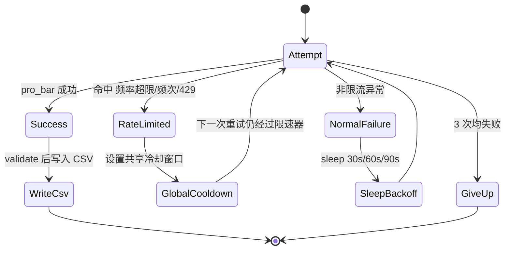

# Fetch K Line Mechanism

本文说明 `pipeline.fetch_kline` 的 K 线下载流程、worker 线程机制、Tushare 限速机制，以及常见配置的影响范围。当前实现仍使用 Tushare `pro_bar(adj="qfq")` 获取前复权日线，并按股票全量覆盖写入 `data/raw/*.csv`。

## End-to-End Flow



关键点：

- `workers` 控制同时执行多少个 `fetch_one` 任务。
- `tushare_requests_per_minute` 控制所有 worker 合计每分钟最多放行多少次 `pro_bar(qfq)`。
- `pro_bar(adj="qfq")` 内部会调用 `adj_factor`，因此即使代码没有显式调用 `adj_factor`，也会消耗该接口频次。
- 当前是全量覆盖：每只股票从 `start` 到 `end` 重新下载并覆盖本地 CSV。

## Worker Queue Model



`ThreadPoolExecutor(max_workers=workers)` 的含义是“最多 N 个线程同时从队列取任务执行”。它不等于接口限速。旧实现中，即使 `workers=2`，两个线程也可能在一分钟内完成 200 多只股票，从而触发 `adj_factor` 的分钟级限制。

加入共享限速器后，worker 可以并发处理任务，但所有 Tushare 请求必须排队通过同一个 `TushareCallLimiter`。

## Tushare Call Sequence



限速器串行化 Tushare 调用有两个原因：

- 避免多个 worker 合计突破 `adj_factor` 的分钟级配额。
- Tushare 报错会打印到 stdout 后抛出 `ERROR.`，包装器需要捕获输出并识别 `频率超限`。

## Retry And Cooldown



命中 Tushare 限流时，不再让单只股票独立盲目重试；共享限速器会设置全局冷却窗口，后续所有 worker 都会受到这个窗口约束。

## Configuration Impact

| 配置项 | 作用 | 影响接口频率 | 建议 |
| --- | --- | --- | --- |
| `workers` | 同时处理多少只股票 | 间接影响；现在不会绕过限速器 | 2 到 4 通常足够 |
| `tushare_requests_per_minute` | 所有 worker 合计每分钟放行多少次 `pro_bar(qfq)` | 直接影响 | 默认 180；稳定后可试 190 |
| `tushare_rate_cooldown_seconds` | 命中限流后的全局冷却秒数 | 降低连续撞限概率 | 默认 70；仍报错可调到 90 到 120 |
| `start` / `end` | 下载日期范围 | 不改变调用次数，但影响每次响应耗时 | 当前为全量覆盖 |
| `exclude_boards` | 过滤股票池 | 直接减少股票数量和调用次数 | 排除不需要的板块 |

## Throughput Estimate

以过滤后的 4415 只股票、`tushare_requests_per_minute: 180` 为例：

```text
理论下限 = 4415 / 180 = 24.5 分钟
```

实际耗时还会叠加：

- Tushare 响应时间。
- CSV 写入和数据校验时间。
- 少量异常重试。
- Tushare 滑动窗口和其他进程共享同一 token 的影响。

如果仍看到 `adj_factor 频率超限`，优先降低 `tushare_requests_per_minute`，而不是只降低 `workers`。例如：

```yaml
workers: 2
tushare_requests_per_minute: 160
tushare_rate_cooldown_seconds: 90
```

如果完全稳定，可逐步提高到：

```yaml
workers: 4
tushare_requests_per_minute: 190
tushare_rate_cooldown_seconds: 70
```

## Current Boundaries

当前修复只处理“不要频繁报错，同时尽可能接近配额上限”。它没有改变数据口径：

- 仍由 Tushare `pro_bar(adj="qfq")` 计算前复权价格。
- 仍按股票全量覆盖写 `data/raw/*.csv`。
- 未改为本地批量缓存 `daily` / `adj_factor` 后自行计算 qfq。

这样做的优点是风险小，策略输入数据口径不变；代价是下载速度仍受 Tushare `adj_factor` 每分钟配额约束。
