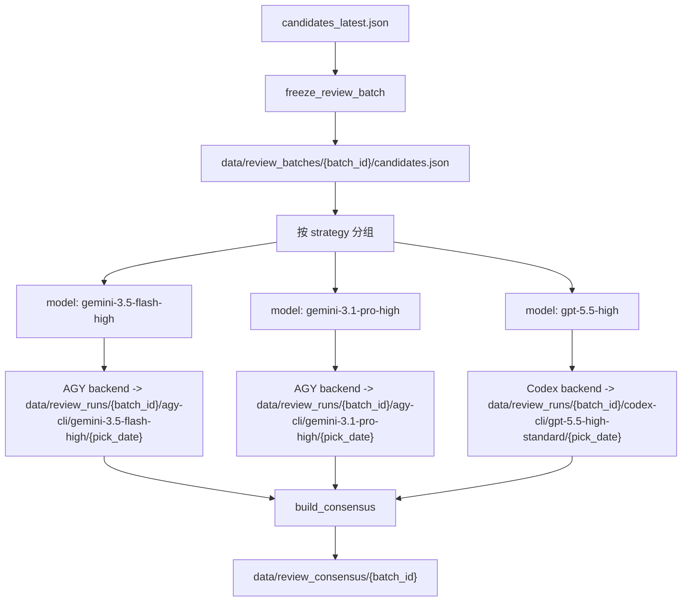

# Multi-Model Review And Consensus

本文说明 Workbench 多模型复评的目标、运行流程、目录结构和共识判定口径。

## Goal

多模型复评用于把同一批候选股票交给多个模型独立打分，最终优先选择所有模型都推荐的股票。执行后端只是运行载体，当前默认模型组合：

- `gemini-3.5-flash-high`：AGY CLI 执行，后端模型名 `Gemini 3.5 Flash (High)`
- `gemini-3.1-pro-high`：AGY CLI 执行，后端模型名 `Gemini 3.1 Pro (High)`
- `gpt-5.5-high`：Codex CLI 执行，`gpt-5.5` + `reasoning_effort=high`

推荐阈值不再使用单一全局 `4.0`。评分归一化仍由 `BaseReviewer.normalize_scores()` 完成，但现在分成三层：公共条件 gate、策略 profile 评分、共识汇总评分。

当前默认策略是“模型不替换”：配置中声明哪个模型，就只运行哪个模型。模型不可用、超时、配额失败或位置限制失败时，系统记录失败原因，并按同一模型断点重跑一次；不会自动换成更便宜、更快或其它供应商模型。

## Flow



## Batch Freezing

多模型复评开始前会冻结候选批次，避免不同模型读取到不同版本的 `candidates_latest.json`。

输出文件：

- `data/review_batches/{batch_id}/candidates.json`
- `data/review_batches/{batch_id}/manifest.json`
- `data/review_batches/latest.json`

manifest 会记录候选 hash、选股日期、候选数量、期望策略、实际策略数量、缺失图表和 prompt hash。默认开启严格校验：缺少 `b1/b2/brick` 中任一策略记录，或缺少候选日线图时中止。

## Reviewer Execution

入口：

```bash
python agent/multi_model_review.py --config config/multi_model_review.yaml
python agent/multi_model_review.py --run-dir data/runs/<run_id>
```

多模型按执行组调度：不同 backend 可以并行，例如 Codex 可与一个 AGY 模型同时跑；同一 backend 默认串行，避免两个 AGY `--print` 进程同时争用 `~/.gemini/antigravity-cli` 的 OAuth、keyring、全局日志和本地 server 状态。同一模型内部按批串行处理；AGY 正式模型默认 `batch_size: 3`，在调用频率和非交互 `--print` 稳定性之间折中，Codex 仍可保持批量 5。各 reviewer 后端会先按 `strategy` 分组，策略变化时提交当前批次，保证同一批 prompt 只包含同一种策略标准。结果按执行后端和 `model_profile` 写入独立目录；共识 summary、进度日志和 Workbench 筛选使用 `model_key`，也就是纯模型 ID。

运行日志中的 `[x/y]` 表示“处理到第 x 个候选”，不等于成功生成了 x 个有效结果。模型日志出现最终汇总行后，多模型进度会优先展示 `成功 X/Y，失败/跳过 Z`，用于区分完成进度和有效结果数量。

`config/multi_model_review.yaml` 中的模型声明是复评边界：

- `no_model_substitution: true`：禁止 `fallback_model`、`substitute_model`、`fallback_reviewer` 等替换配置。
- `rerun_failed_models_once: true`：所有模型首轮结束后，只对失败模型按原模型再跑一次。
- `skip_existing: true`：重跑时跳过已经写好的单股结果，用于补齐失败或缺失项。
- AGY 默认 `print_timeout=6m`、`timeout_seconds=360`。批量子进程达到总超时时优先按同一模型拆小批；单股仍超时时再按模型级失败处理，由多模型编排按原模型断点重跑。
- Codex 正式路径默认锁定 `gpt-5.5`、`reasoning_effort=high`、标准速度；如需临时试验非 5.5，必须显式 `force_fixed_model: false`，并且不能作为正式降级替换。

进程失败会写入 `data/runs/<run_id>/multi_model_logs/*.log`，共识 summary 中的 `review_runs` 会记录 exit code、日志路径、失败摘要和是否重跑恢复。任一正式模型最终失败时，多模型命令返回非零退出码；已经生成的部分结果可用于排障，但 `complete=false` 或 `incomplete` 结果不能作为最终交易决策。

## Strategy Review Scoring

评分体系主要落在 AI 复评环节，前置 `fetch_kline -> run_preselect -> code+strategy 去重` 不改变。

复评分三层：

1. 公共条件 gate：先判断所有战法共用的交易前提。活跃市值/大盘择时由用户人工确认，本轮不由模型臆测；图中可判断的白黄线资格、止损可控、上方压力、量价健康和买后纪律必须评分。公共 gate 硬否决时，最终不能 PASS。
2. 策略 profile：公共 gate 通过后，按来源策略解释同名字段和权重。`b1` 偏回调建仓质量，`b2` 偏确认强度和量价接管，`brick` 偏绿转红后 1-4 日超短延续。
3. 本地归一化：模型仍输出统一 JSON，但 `total_score`、`verdict` 会由本地程序按 `config/multi_model_review.yaml` 中的 `review_scoring` 和默认 profile 重算。

默认公共 gate：

| 项目 | 数值 |
|---|---:|
| PASS | 3.2 |
| WATCH | 2.6 |
| hard_fail_below | 2.2 |

公共 gate 中 `trend_qualification`、`support_stop_loss_control`、`overhead_room`、`volume_health` 任一项 `<= 1` 会硬否决；任一核心项 `<= 2` 时，即使平均分较高，公共 gate 也最多 WATCH。

默认策略门槛：

| strategy | PASS | WATCH | 目标 |
|---|---:|---:|---|
| `b1` | 4.1 | 3.4 | 回调建仓是否值得跟踪/试仓 |
| `b2` | 4.2 | 3.5 | B1 后确认是否足够强 |
| `brick` | 4.2 | 3.5 | 绿转红后 1-4 日延续概率 |

默认策略权重：

| strategy | trend_structure | price_position | volume_behavior | previous_abnormal_move | classic_pattern_match |
|---|---:|---:|---:|---:|---:|
| `b1` | 20% | 35% | 25% | 10% | 10% |
| `b2` | 15% | 20% | 40% | 10% | 15% |
| `brick` | 10% | 25% | 25% | 10% | 30% |

策略 profile 也包含低分上限：例如 B1 的 `price_position` 或 `volume_behavior` 只有 2 分时，即使总分达到 PASS，也会被压到 WATCH；Brick 的 `classic_pattern_match` 只有 1 分时会硬否决。

每个复评 JSON 会保留：

- `common_gate`: 公共条件分数、硬否决和说明。
- `strategy_score`: 按策略 profile 算出的专项分。
- `common_gate_score` / `common_gate_status`: 公共条件结果。
- `score_profile`: 本次使用的策略权重和门槛。

Codex reviewer 通过非交互命令执行：

```bash
codex --ask-for-approval never exec \
  --ignore-rules \
  -c model_reasoning_effort=\"high\" \
  -c fast_default_opt_out=true \
  --model gpt-5.5 \
  --sandbox read-only \
  --ephemeral \
  --output-schema schema.json
```

默认 `auth_mode: local_oauth`，读取本机 Codex CLI 用户配置和 OAuth 登录态（`~/.codex/config.toml` / `~/.codex/auth.json`），不注入 API key provider，也不强制 `preferred_auth_method="apikey"`。在默认 OAuth 模式下，reviewer 会从 Codex 子进程环境里剥离 `CODEX_OPENAI_*` / `OPENAI_API_KEY` / `OPENAI_BASE_URL` / `OPENAI_API_BASE`，避免残留环境变量把复评带回 API-key 或本地代理路径。

如果确实要兼容 CCSwitch 这类 OpenAI-compatible 本地代理，必须在 [config/codex_cli_review.yaml](../config/codex_cli_review.yaml) 显式打开：

```yaml
auth_mode: env_provider
env_provider_enabled: true
```

并设置代理环境变量：

```bash
export CODEX_OPENAI_BASE_URL=http://127.0.0.1:8317/v1
export CODEX_OPENAI_API_KEY=<ccswitch-api-key>
```

打开后，`CODEX_OPENAI_BASE_URL` 会被写入本次命令的 `model_providers.env_custom.base_url`，`CODEX_OPENAI_API_KEY` 只会映射到子进程环境变量 `OPENAI_API_KEY`，不会进入命令行或 raw log。这个模式是旧兼容路径，不是默认推荐路径。

### Codex CLI 进度卡住排障

如果 Codex reviewer 长时间停在 `0%`、`1%` 或只停留在第一批附近，先检查该 reviewer 的 raw log：

- `data/review_runs/{batch_id}/codex-cli/{profile}/{pick_date}/codex_cli_runs/*/stderr.txt`
- `data/runs/{run_id}/multi_model_logs/codex-cli__{profile}.log`

Workbench 的“复评配置”页按模型提供选择；选择 `gpt-5.5-high` 时会显示完整 Codex 调用模式配置，在“三模型共识”模式下也会显示“Codex 子模型调用模式”，用于写入本次 run snapshot。

如果 stderr 中出现 `401 Unauthorized`、`Invalid API key`、`Incorrect API key provided`，且请求地址是 `http://127.0.0.1:8317/v1/...`，说明本次 Codex 子进程仍在走旧的本地代理/API-key provider。先检查当前基础配置和 run snapshot 里的 `codex_cli_review.yaml`，确认 `auth_mode: local_oauth`、`env_provider_enabled: false`、`ignore_user_config: false`。如果错误来自原生 Codex OAuth 登录态，则重新执行 `codex login` 或在 Codex App 里重新登录后重跑。

这类认证错误不是模型慢，也不是进度统计问题。没有单票 JSON 写出时，真实完成数就是 0；旧实现会把认证失败当成普通批量失败，继续重试、拆批、逐只 fallback，造成看起来一直卡住。当前实现会把 `401` / API key 错误归类为 `CodexCliAuthError` 并快速失败，由多模型编排保留其他 reviewer 的进度。

## Consensus Output

共识输出目录：

- `data/review_consensus/{batch_id}/summary.json`
- `data/review_consensus/{batch_id}/decisions.json`
- `data/review_consensus/{batch_id}/details.json`
- `data/review_consensus/{batch_id}/decisions.csv`
- `data/review_consensus/{batch_id}/details.csv`

`details` 是模型粒度明细，可按策略和模型查看分数、结论、推荐意见。`decisions` 是股票粒度结果集，按 `code+strategy` 对齐所有模型。

共识推荐判断同样按策略 profile，而不是全局 `score >= 4.0`。例如 `brick` 默认需要 `total_score >= 4.2` 且 `verdict=PASS` 才算该模型推荐。

`decisions` 额外输出：

- `average_score`: 已完成模型的平均分。
- `agreement_score`: 推荐模型占比换算到 0-5。
- `consensus_score`: `average_score * 0.70 + agreement_score * 0.30`。
- `consensus_verdict`: `PASS` / `WATCH` / `FAIL` / `INCOMPLETE`。
- `strategy_pass_min` / `strategy_watch_min`: 当前策略门槛。

决策分组使用 Gemini、AGY、Codex 三路正式模型：

- `all_models_recommended`: 所有正式模型都完成评分且都推荐
- `majority_recommended`: 多数模型推荐
- `single_model_recommended`: 仅一个模型推荐
- `none_recommended`: 无模型推荐
- `incomplete`: 至少一个正式模型缺失评分

`incomplete` 不能作为最终决策依据。此时应断点重跑多模型复评，直到 Gemini、AGY、Codex 三路都对所有候选完成评分。

## Workbench Views

Workbench 新增：

- 复评配置 -> `Codex GPT-5.5`
- 复评配置 -> `多模型复评`
- 侧边栏 -> `共识结果`
- 共识结果 -> `导入通达信`

`共识结果` 包含三个视图：

- 决策结果集：按策略、决策分组和 Z 裁决查看最终股票集合。
- Z质量裁决：查看 `A_SELECT`、`B_WATCH`、`C_REVIEW_ONLY`、`REJECT`、Z 分、硬否决、观察限制、理由和风险。
- 模型评分明细：按策略、模型和推荐状态查看每个模型的评分与意见。

共识结果导入通达信时，可以使用快捷方案或自定义筛选：

- 共同推荐：所有模型均 PASS。
- 多模型推荐：推荐模型数达到多数。
- 单模型推荐：仅一个模型 PASS，适合复盘分歧。
- 共同观察、多模型观察、单模型观察：用于跟踪 WATCH 样本。
- Z精选、Z观察、Z精选+观察、Z复盘样本：按 Z 质量层裁决导出精选池或观察池。
- 分歧样本：至少一个模型推荐且至少一个模型不推荐。

导入前会按策略分组生成板块，板块名前缀区分来源，例如多数推荐使用 `CM`，共同推荐使用 `CA`，Z 精选使用 `ZA`，Z 观察使用 `ZW`。自定义筛选可叠加 Z 裁决、Z 质量分、排除 Z 硬否决、排除 Z 观察限制、模型状态、推荐/观察/不推荐数量和共识分。导入链路复用正式结果中心的通达信导出能力，支持下载 `.bat`、浏览器写入和本地路径直写。

## Cleanup Notes

多模型探索阶段可能在 `data/review_runs/{batch_id}` 或 `data/runs/<run_id>/multi_model_logs` 留下历史试验模型目录，例如临时的 2.5/5.4/Claude 路径。判断某个批次的当前有效口径时，以 `data/review_consensus/{batch_id}/summary.json` 中的 `models`、`generated_at` 和 `complete` 为准，而不是目录下所有曾经出现过的模型文件。

`data/review_consensus/latest.json` 只表示最近一次成功写出的共识 summary。若 workbench pid 文件存在但进程已退出，该 pid 文件只是历史启动记录，不代表工作台仍在运行。

## Backtest Plan

实现稳定后，可固定某个选股日期重新跑基础候选，再分别汇总 `gemini-3.5-flash-high`、`gemini-3.1-pro-high`、`gpt-5.5-high` 和全票共识的推荐结果，用后续 K 线计算胜率、平均收益、最大回撤和分策略表现。
