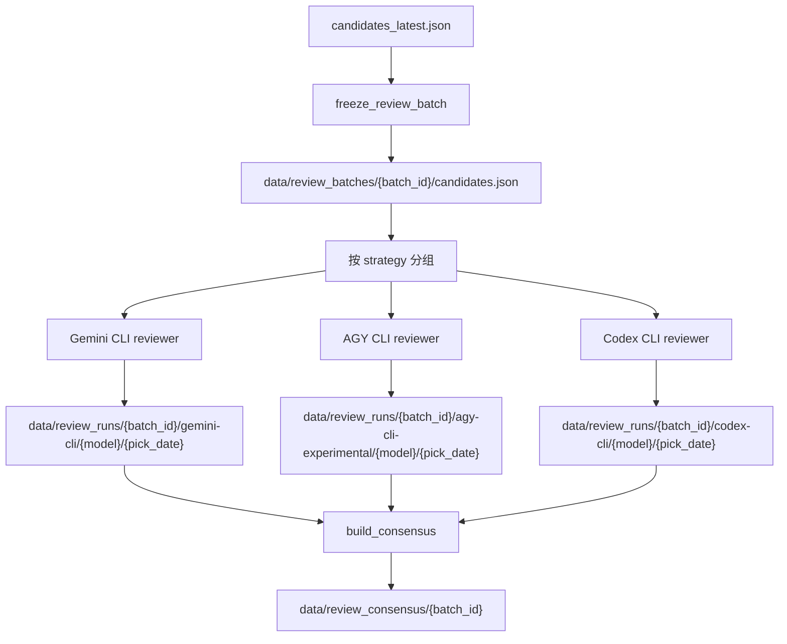

# Multi-Model Review And Consensus

本文说明 Workbench 多模型复评的目标、运行流程、目录结构和共识判定口径。

## Goal

多模型复评用于把同一批候选股票交给多个 reviewer 独立打分，最终优先选择所有模型都推荐的股票。当前默认模型组合：

- Gemini CLI: `gemini-3.1-pro-preview`
- AGY CLI: `Gemini 3.5 Flash (High)`
- Codex CLI: `gpt-5.5`，`reasoning_effort=high`，标准速度路径

推荐阈值不再使用单一全局 `4.0`。评分归一化仍由 `BaseReviewer.normalize_scores()` 完成，但现在分成三层：公共条件 gate、策略 profile 评分、共识汇总评分。

## Flow



## Batch Freezing

多模型复评开始前会冻结候选批次，避免不同模型读取到不同版本的 `candidates_latest.json`。

输出文件：

- `data/review_batches/{batch_id}/candidates.json`
- `data/review_batches/{batch_id}/manifest.json`
- `data/review_batches/latest.json`

manifest 会记录候选 hash、选股日期、候选数量、期望策略、实际策略数量、缺失图表和 prompt hash。默认开启严格校验：缺少 `b1/b2/brick` 中任一策略记录，或缺少候选日线图时中止。

## Reviewer Execution

入口：

```bash
python agent/multi_model_review.py --config config/multi_model_review.yaml
python agent/multi_model_review.py --run-dir data/runs/<run_id>
```

多模型之间并行执行；每个工具内部按批串行处理，默认 `batch_size: 5`。各 reviewer 会先按 `strategy` 分组，策略变化时提交当前批次，保证同一批 prompt 只包含同一种策略标准。各 reviewer 写入独立目录，不覆盖正式 Gemini CLI 结果。

## Strategy Review Scoring

评分体系主要落在 AI 复评环节，前置 `fetch_kline -> run_preselect -> code+strategy 去重` 不改变。

复评分三层：

1. 公共条件 gate：先判断所有战法共用的交易前提。活跃市值/大盘择时由用户人工确认，本轮不由模型臆测；图中可判断的白黄线资格、止损可控、上方压力、量价健康和买后纪律必须评分。公共 gate 硬否决时，最终不能 PASS。
2. 策略 profile：公共 gate 通过后，按来源策略解释同名字段和权重。`b1` 偏回调建仓质量，`b2` 偏确认强度和量价接管，`brick` 偏绿转红后 1-4 日超短延续。
3. 本地归一化：模型仍输出统一 JSON，但 `total_score`、`verdict` 会由本地程序按 `config/multi_model_review.yaml` 中的 `review_scoring` 和默认 profile 重算。

默认策略门槛：

| strategy | PASS | WATCH | 目标 |
|---|---:|---:|---|
| `b1` | 4.0 | 3.3 | 回调建仓是否值得跟踪/试仓 |
| `b2` | 4.1 | 3.4 | B1 后确认是否足够强 |
| `brick` | 4.2 | 3.5 | 绿转红后 1-4 日延续概率 |

每个复评 JSON 会保留：

- `common_gate`: 公共条件分数、硬否决和说明。
- `strategy_score`: 按策略 profile 算出的专项分。
- `common_gate_score` / `common_gate_status`: 公共条件结果。
- `score_profile`: 本次使用的策略权重和门槛。

Codex reviewer 通过非交互命令执行：

```bash
codex --ask-for-approval never exec \
  --ignore-user-config --ignore-rules \
  -c model_reasoning_effort=\"high\" \
  -c fast_default_opt_out=true \
  --model gpt-5.5 \
  --sandbox read-only \
  --ephemeral \
  --output-schema schema.json
```

## Consensus Output

共识输出目录：

- `data/review_consensus/{batch_id}/summary.json`
- `data/review_consensus/{batch_id}/decisions.json`
- `data/review_consensus/{batch_id}/details.json`
- `data/review_consensus/{batch_id}/decisions.csv`
- `data/review_consensus/{batch_id}/details.csv`

`details` 是模型粒度明细，可按策略和模型查看分数、结论、推荐意见。`decisions` 是股票粒度结果集，按 `code+strategy` 对齐所有模型。

共识推荐判断同样按策略 profile，而不是全局 `score >= 4.0`。例如 `brick` 默认需要 `total_score >= 4.2` 且 `verdict=PASS` 才算该模型推荐。

`decisions` 额外输出：

- `average_score`: 已完成模型的平均分。
- `agreement_score`: 推荐模型占比换算到 0-5。
- `consensus_score`: `average_score * 0.70 + agreement_score * 0.30`。
- `consensus_verdict`: `PASS` / `WATCH` / `FAIL` / `INCOMPLETE`。
- `strategy_pass_min` / `strategy_watch_min`: 当前策略门槛。

决策分组：

- `all_models_recommended`: 所有模型都完成评分且都推荐
- `majority_recommended`: 多数模型推荐
- `single_model_recommended`: 仅一个模型推荐
- `none_recommended`: 无模型推荐
- `incomplete`: 至少一个模型缺失评分

`incomplete` 不能作为最终决策依据。此时应断点重跑多模型复评，直到所有模型对所有候选完成评分。

## Workbench Views

Workbench 新增：

- 复评配置 -> `Codex GPT-5.5`
- 复评配置 -> `多模型复评`
- 侧边栏 -> `共识结果`

`共识结果` 包含两个视图：

- 决策结果集：按策略和决策分组查看最终股票集合。
- 模型评分明细：按策略、模型和推荐状态查看每个模型的评分与意见。

## Backtest Plan

实现稳定后，可固定某个选股日期重新跑基础候选，再分别汇总 Gemini CLI、AGY、Codex 和全票共识的推荐结果，用后续 K 线计算胜率、平均收益、最大回撤和分策略表现。
